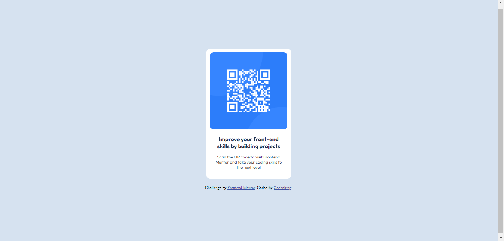

# Frontend Mentor - QR code component solution

This is a solution to the [QR code component challenge on Frontend Mentor](https://www.frontendmentor.io/challenges/qr-code-component-iux_sIO_H). Frontend Mentor challenges help you improve your coding skills by building realistic projects. 

## Table of contents

- [Overview](#overview)
  - [Screenshot](#screenshot)
  - [Links](#links)
- [My Process](#my-process)
  - [Built with](#built-with)
  - [What I learned](#what-i-learned)
  - [Useful resources](#useful-resources)
- [Author](#author)
- [Socials](#socials)

## Overview

### Screenshot

### Links

- Solution URL: [Add solution URL here](https://your-solution-url.com)
- Live Site URL: [Add live site URL here](https://your-live-site-url.com)

## My Process

### Built with

- HTML5
- CSS3

### What I learned
I learnt how to center a div (it looks zsurprisingly easy in theory but practically, that was the hardest part of te project)

### Useful resources

- https://www.browserstack.com/guide/responsive-design-breakpoints
I used this resource to find out how to properly place the breakpoints

- https://www.w3schools.com/howto/howto_css_center-vertical.asp
I used this resource to learn how to properly center a div both vertically and horizontally

- https://www.youtube.com/watch?v=QdITQ4upjME&t=146s
With this resource, I learnt that the attributes given to the parent element played a huge part on the positioning of the child element.

- https://www.youtube.com/watch?v=8JXZCpNGG4w
With this resource, I learnt how to add screenshots to a github README file

- Chatgpt

## Author

# [@codhaking](https://www.github.com/codhaking)

## Socials

---
[][1][][2][][3]
---

[1]: http://www.twitter.com/devonwubiko
[2]: https://www.linkedin.com/in/okem-onwubiko
[3]: https://www.facebook.com/onwubikookem